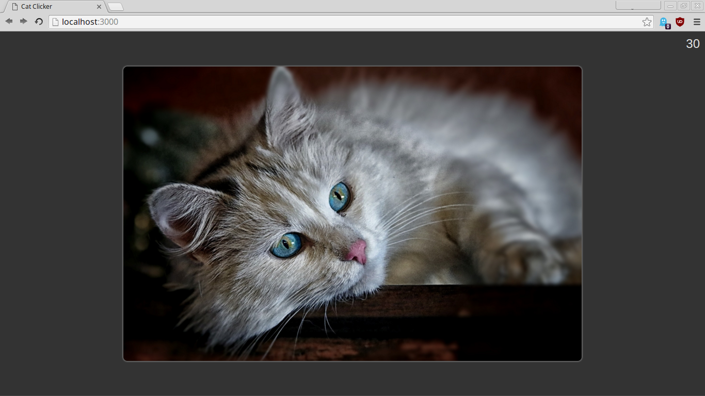

# Cat Clicker, version 1

This is the first version of the "Cat Clicker" application, created before working through the Design Patterns course.

Included for comparison.

## Project Requirements

**Original**
- Displays a picture of a cat.
- Displays a number representing clicks.
- The number of clicks increments when the cat picture is clicked.
**Added**
- Displays pictures of two cats.
- Displays the cat's name above the picture.

## Local Setup

**Prerequisites:**
- [Node](https://nodejs.org/en/)
- [Gulp](http://gulpjs.com/)

**Install dependencies.**
- In cat-clicker-v1 directory: `npm install`.

**Run desired Gulp task.**
- `gulp` *(To serve source files.)*
- `gulp build; gulp serve:dest` *(To build and serve distribution files.)*
