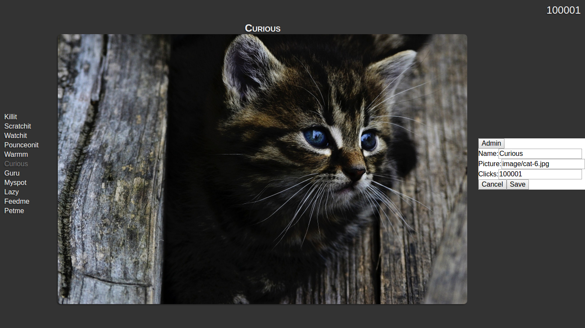

# Cat Clicker, version 2

This is the second version of the "Cat Clicker" application, created after working through the Design Patterns course.

## Project Requirements

**Original**
- Displays a list of cats by name.
- Displays details for a selected cat; including name, picture, and clicks.
- The number of clicks for the selected cat increments when the cat picture is clicked.
- The selected cat changes when a cat in the list of cats is clicked.

**Revision #1**
- Displays an admin button that toggles display of an admin area.
- Optionally displays an admin area with inputs for changing the cat's name, url, and number of clicks. (Hidden by default.)
- The admin area inputs are filled in with current values.
- The admin area includes a cancel button, which hides the area and discards changes.
- The admin area includes a save button, which submits the changes and updates the view.

## Local Setup

**Prerequisites:**
- [Node](https://nodejs.org/en/)
- [Gulp](http://gulpjs.com/)

**Install dependencies.**
- In cat-clicker-v2 directory: `npm install`.

**Run desired Gulp task.**
- `gulp` *(To serve source files.)*
- `gulp build; gulp serve:dest` *(To build and serve distribution files.)*
