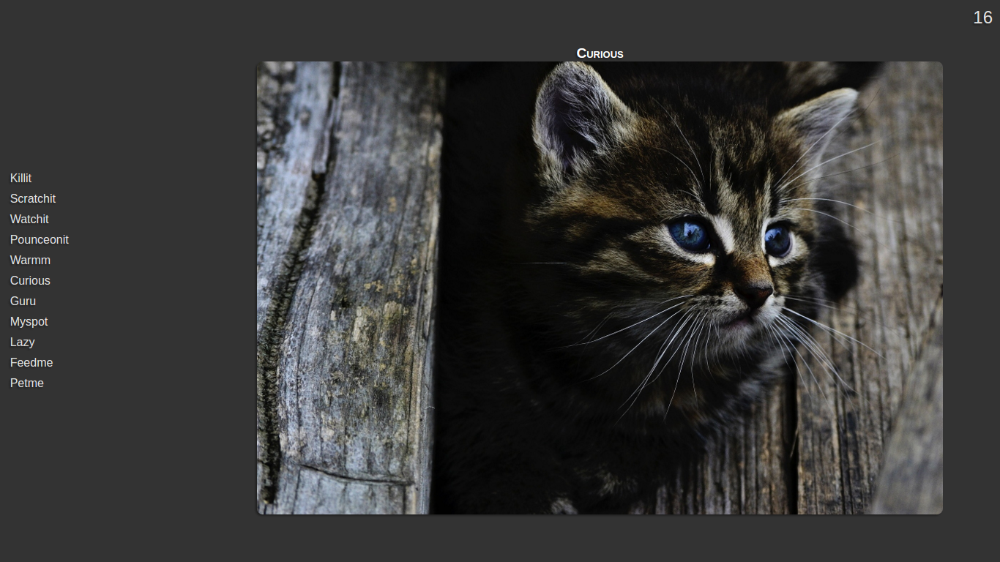

# Cat Clicker, v1

This is the first version of the "Cat Clicker" application, created before working through the [Design Patterns course](https://www.udacity.com/course/ud989-nd).

It is included for comparison with [version 2](https://github.com/Tempurturtul/udacity-fend-projects/tree/master/fend-design-patterns/cat-clicker-v2), which was created after working through the course.



## Quickstart

**Prerequisites:**
- [Node](https://nodejs.org/en/)
- [Gulp](http://gulpjs.com/)

**Clone the repository, navigate to this project, and install dependencies.**
```
  git clone https://github.com/Tempurturtul/udacity-fend-projects.git
  cd udacity-fend-projects/fend-design-patterns/cat-clicker-v1/
  npm install
```

**Run the default gulp task to serve source files.** *(See `gulpfile.js` for additional tasks.)*
```
  gulp
```

## Udacity's Project Requirements

**Original Requirements**
- ~~Displays a picture of a cat.~~
- Displays a number representing clicks.
- The number of clicks increments when the cat picture is clicked.

**Revised Requirements 1**
- ~~Displays pictures of two cats.~~
- Displays the cat's name above the picture.

**Revised Requirements 2**
- Displays a list of at least 5 cats by name.
- Displays a picture of the selected cat along with it's name in a display area.
- Clicks tracked separately for each cat.
